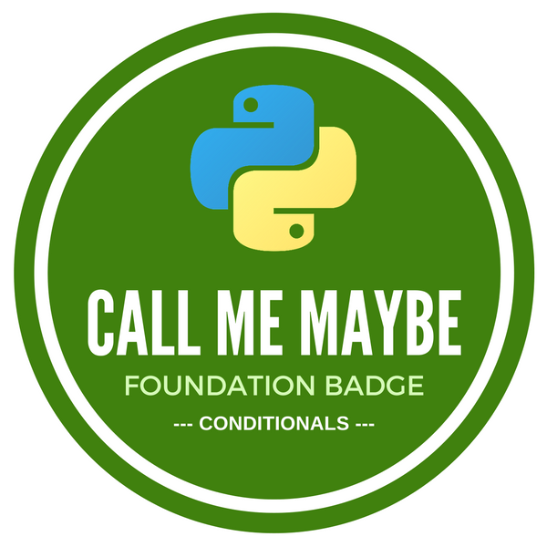
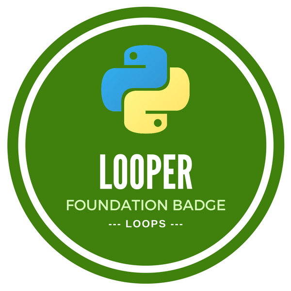
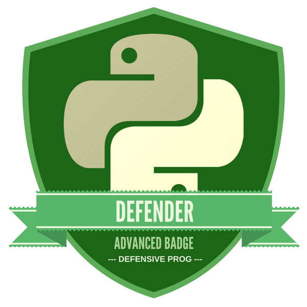

# Programming

This module will introduce you to programming using Python, a popular language for use in scientific computing. There are many code libraries built on top of Python, allowing you to extend its functionality for a wide range of purposes.  The skills you develop in this module will also be relevant in any other programming languages you may use in future.

## Learning Outcomes

Upon completion of this module you should be able to:

-  Understand and use basic control structures in Python
-  Create simple Python programs using named variables and control structures
-  Debug and create tests for basic Python programs.
- Understand why testing is used in software development. Write unit tests for functions.
{:.learning-outcomes}

## Independent | Use Python

Learn how to create and run Python files.

- [Tutorial (TODO)](#)

## Classroom | Getting Started With Python

Getting started with Python. Assigning values to variables, control structures and storing data.

- [Activity: Getting Started (Software Carpentry)](http://swcarpentry.github.io/python-novice-inflammation/)
- [Activity: Loading and Manipulating Data (Software Carpentry)](http://swcarpentry.github.io/python-novice-inflammation/01-numpy/)
- [Activity: Repeating Actions with Loops (Software Carpentry)](http://swcarpentry.github.io/python-novice-inflammation/02-loop/)
- [Activity: Storing Multiple Values in Lists (Software Carpentry)](http://swcarpentry.github.io/python-novice-inflammation/03-lists/)
- [Activity: Analysing Data from Multiple Files (Software Carpentry)](http://swcarpentry.github.io/python-novice-inflammation/04-files/)
- [Activity: Making Choices (Software Carpentry)](http://swcarpentry.github.io/python-novice-inflammation/05-cond/)

## Classroom | Creating Functions and Good Development Practices

Creating functions, Defensive Programming and Test Driven Development.

- [Activity: Creating Functions (Software Carpentry)](http://swcarpentry.github.io/python-novice-inflammation/06-func/)
- [Activity: Errors and Exceptions (Software Carpentry)](http://swcarpentry.github.io/python-novice-inflammation/07-errors/)
- [Activity: Defensive Programming (Software Carpentry)](http://swcarpentry.github.io/python-novice-inflammation/08-defensive/)
- [Activity: Debugging (Software Carpentry)](http://swcarpentry.github.io/python-novice-inflammation/09-debugging/)
- [Activity: Command-Line Programs (Software Carpentry)](http://swcarpentry.github.io/python-novice-inflammation/10-cmdline/)

## Independent | Project Data Analysis

Begin writing programs that will help you analyse the data from your course project. 

- [Worksheet (TODO)](#)
{:.resources}

## Badges

1. ### [Call Me Maybe | _Conditionals_](badges/call-me-maybe.html)
  
  Use a conditional statement to run different code based on a given value.
  [&raquo; Assessment Details](badges/call-me-maybe.html)

2. ### [Looper | _Loops and Lists_](badges/looper.html)
  
  Using Python, write a script which loops over a list of items to find a summarised result.
  [&raquo; Assessment Details](badges/looper.html)

3. ### [Composer | _Functions_](badges/composer.html)
  
  Using Python, write a script which uses a function to improve the code structure and clarity.
  [&raquo; Assessment Details](badges/composer.html)

4. ### [Input and Output](badges/input-output.html)
  
  Using Python, write a script to ask the user for a file to process, then save the program's output to another file.
  [&raquo; Assessment Details](badges/input-output.html)

5. ### Defender | _Defensive Programming_ (coming soon)
   
  Given a simple function, refactor the code to increase function stability by addressing edge cases and faulty or incorrect input.

6. ### The Stig | _Test Driven Development_ (coming soon)
  
  Use the Test Driven Development process of "red, green, refactor" to design, test and implement a function.
  

7. ### Safety Net | _Error Handling_ (coming soon)
  
  Increase the stability of a piece of code by catching and handling common errors, then providing user feedback rather than exiting.
{:.badges}

