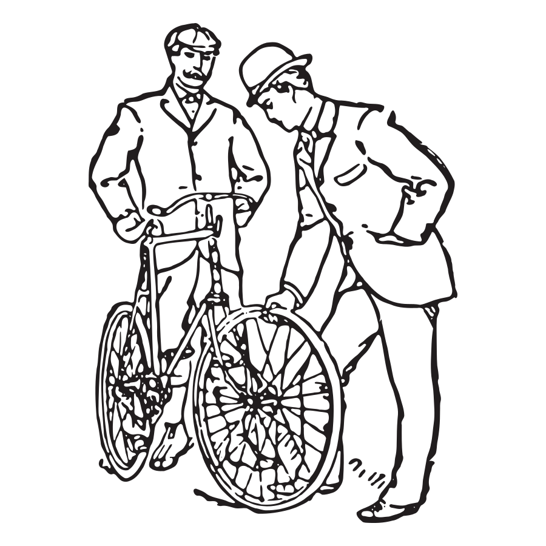

---
layout: slideshow
title: Project Management Introduction
slides:

  - content: |
      
      _Project Management_

      # Introduction

    notes: |

      Having a basic understanding of project management will allow you to manage your own projects better and also work more effectively as part of a team.

  - content: |

      ## Definitions of "Project Failure"

      - {:height="200"}
        **Over budget**
      - {:height="200"}
        **Over time**
      - {:height="200"}
        **Doesn't work**
      {:.horizontal-list}

      Effective project management minimises the risk of failure
      by addressing the primary causes of those failures.
  
    notes: |

      

      - It is impossible to gather all the requirements at the beginning of a project
      - Whatever requirements you do gather are likely to change 
      - There will always be more to do than time and money will allow

      

  
  

  
  - content: |

      ## Reasons why projects fail

      - **Bad Planning**
      - **Bad Communication**
      - **Scope Creep**
      {:.horizontal-list}

      Through project management processes we can work
      on minimising interference from these factors.

  - notes: |

      Another reason for project failure may be lack of resources.

      For a physical product, a shipment may be unable to be fulfilled.

      For a software product, a key perosn may leave the team.

      Backup plans are important!

  - content: |

      ## Assembly Lines

      

      Traditionally, products have been created in a linear fashion,
      with each phase being completed before the next begins.

      This project management style is known as "Waterfall".

    notes: |

      In 1970, Dr. Winston Royce presented a paper entitled “Managing the Development of Large Software Systems,” which criticized sequential development. He asserted that software should not be developed like an automobile on an assembly line, in which each piece is added in sequential phases. 
      
      In such sequential phases, every phase of the project must be completed before the next phase can begin. Dr. Royce recommended against the phase based approach in which developers first gather all of a project’s requirements, then complete all of its architecture and design, then write all of the code, and so on. 
      
      Royce specifically objected to this approach due to the lack of communication between the specialized groups that complete each phase of work.

      _Credit: [agilemthodology.org](http://agilemethodology.org/)_

      _Image Credit: [SpunkySix on Deviantart](http://spunkysix.deviantart.com/art/Assembly-Line-216453732)_

  - content: |

      ## The "Waterfall" Approach

      {:height="400"}

      The downside of Waterfall is that there is very little room
      to adapt to changing circumstances or requirements.

    notes: |

      Waterfall is less terrible when:

      - The requirements for the finished product are complete, clear and stable
      - The effort required to complete the project can be easily predicted
      - Rapid or dynamic changes to scope are rare
      - The total duration is small
      
      Dr Winston Royce said that Waterfall needed 5 things to reduce the risk of doing waterfall:

      - Solution design
      - Document the design
      - Do it twice
      - Plan, control and monitor testing
      - Involve the customer
       
      Downside of waterfall is that feedback from the end customer doesn’t usually happen until near the end of the project after development and testing have been started worse, completed.

  - content: |

      ## The "Agile" Approach

      {:height="400"}
      
      The team repeats a shorter cycle of plan, build, test
      until the customer is happy with the product.

    notes: |
      
      With an Agile approach, we break the project into smaller pieces of work which are completed over a much shorter time frame, usually around 2 weeks for each piece.

      At the end of each time block, known as a "sprint", we put the product in front of the customer for testing and feedback.

      The Agile approach provides:
      - Small iterative development sprints
      - Fast delivery of value to the customer
      - Early opportunities to fail
      - Ability to accommodate change easily during build
      - Early opportunities to get customer feedback
      - High levels of collaboration between the various roles in the team
      - Smaller tasks to manage reducing complexity
      - Builds cross functional teams
      - Predictable costs and schedules
      - Better quality outcomes
      - Higher focus on customer needs

      Image Credit: [Dave Gray](https://www.flickr.com/photos/davegray/6865783267)

  - content: |

      ## Agile Development

      {: height="490"}

    notes: |

      In Agile we only make a little bit of progress at a time, and show the customer our progress regularly. This process requires thoughtfulness and planning, as demonstrated in this comic!

      The top row illustrates a common misconception about iterative, incremental product development. With each delivery the product gets closer to done, but the customer is still angry because he can’t actually use the product. It’s still just a partial car.

      In the second row, we focus on the underlying need the customer wants fulfilled. Turns out that his underlying need is “I need to get from A to B faster”, and a car is just one possible solution to that. At each step the customer doesn't yet have what they want, but in the meantime they are actually using this product, and giving us feedback.

      Our goal is to have a testable product at each step. Even if the product isn't great, it should solve the problem to some degree and allow for the customer to provide feedback to guide future development.

      _Credit Henrik Kniberg: [Read full blog post](http://blog.crisp.se/2016/01/25/henrikkniberg/making-sense-of-mvp)_

  - content: |

      ## Agile is a movement 
      in which people work to uphold the values
      and principles defined in the [Agile Manifesto](http://www.agilemanifesto.org/).

      Being "Agile" means being customer-focused, adapting to change,
      delivering iterative improvement and valuing communication.

    notes: |

      Being "Agile" just means that your approach to project management focuses on the Agile values and principles.

      That is, an Agile team will be customer-focused, will be comfortable adapting to unexpected change, will deliver progress in an incremental fashion, and will involve the customer in the process.

      There are many different Agile methodologies, such as Scrum, Lean, Kanban, DSDM and others.

      During this course we will explore the use of Scrum, which the most widely used Agile methodology.

  - content: |

      ## Scrum is a methodology 
      which can help us be Agile

      {:height="300"}

      Scrum defines the process we use to develop our project,
      through cycles of planning, implementation and testing.

    notes: |

      Scrum defines a set of processes and communication requirements that the team follows in order to work in an Agile fashion.

      Scrum defines roles and responsibilities for team members. It also defines how meetings are run, how often and for how long.

      Scrum is focused around getting teams to be decisive and confident in ability to deliver work during each work cycle, or "sprint".

  - content: |

      ## What we covered

      - {:height="200"}
        **Waterfall**
        Is the traditional linear approach to project delivery.
      - {:height="200"}
        **Agile**
        Is a movement which is an alternative to Waterfall.
      - {:height="200"}
        **Scrum**
        Is a methodology which provides processes we can use to be Agile.
      {:.horizontal-list}

    notes: |

      In this presentation we've covered the main difference between Waterfall and Agile project management, which is Agile's iterative approach as opposed to the linear approach used in Waterfall.

      We've also introduced Scrum, which is the most popular Agile methodology and will be the focus of this course.

---