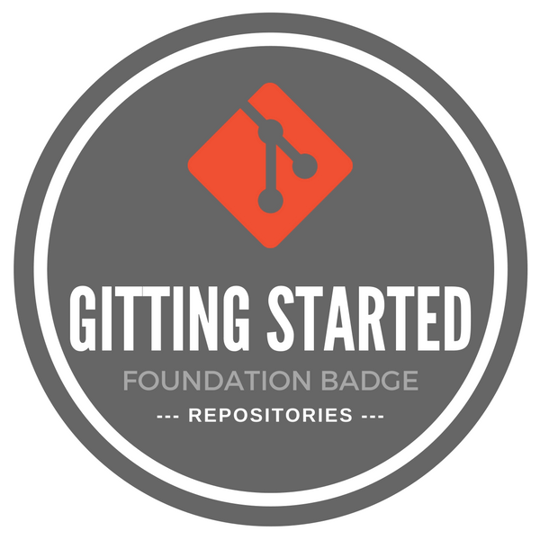
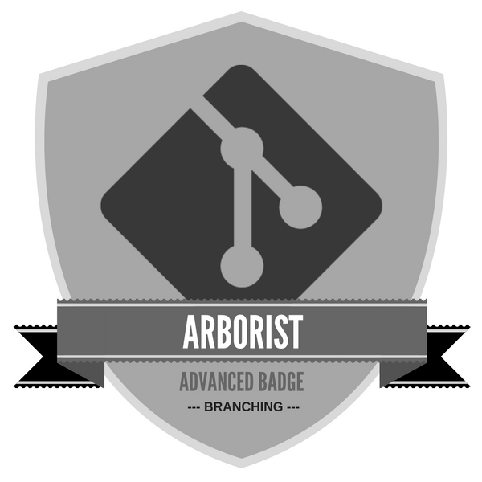

# Version Control

This module will introduce you to the workflows used with the popular version control system Git. The concepts learned in this module will be applied to the management of your personal project throughout the course.

## Learning Outcomes

Upon completion of this module you should be able to:

- Understand the benefits of an automated version control system.
- Configure and personalize Git to suit your own preferences.
- Understand at a conceptual level how Git works; how information is stored and shared at each stage of Git's workflow.
- Create and use Git local repositories using basic tools and commands; committing files, tracking changes and restoring files. 
- Collaborate with others using remote repositories and understand the advantages of doing so. Push and pull to remote repositories. Handle conflicts and communicate with collaborators to resolve them, using Git tools and commands.
{:.learning-outcomes}

## Independent | Create a GitHub Account

Register and verify your GitHub account, ready for classroom use.

- [Slideshow: Creating a GitHub Account][github-setup]
- [Activity: Request to join course organisation (TODO)](#)
{:.resources}

[github-setup]: {{ site.slideshows }}/modules/version-control/creating-a-github-account

## Classroom | Introduction to Git

Introduction to the basics of Version Control, Git and GitHub.

**Schedule**

- [Lecture: Version Control Introduction][intro]
- [Activity: Install and Configure Git (Software Carpentry)][install]
- [Lecture: Repositories][repos]
- [Activity: Create a Repository (Software Carpentry)][create-repo]
- [Lecture: Git Workflow][wkflow-slides]
- [Activity: Tactile Git Workflow][tactile-wkflow]
- [Activity: Shell Git Workflow (Software Carpentry)][sc-wkflow]
{:.resources}

[intro]: {{site.slideshows}}/modules/version-control/introduction
[install]: http://swcarpentry.github.io/git-novice/02-setup/
[repos]: {{site.slideshows}}/modules/version-control/repositories
[create-repo]: http://swcarpentry.github.io/git-novice/03-create/
[wkflow-slides]: {{site.slideshows}}/modules/version-control/git-workflow
[tactile-wkflow]: activities/tactile-git-workflow.html
[sc-wkflow]: http://swcarpentry.github.io/git-novice/04-changes/

**Resources**

- [Version Control with Git (Software Carpentry)](http://swcarpentry.github.io/git-novice/)
- [Automated Version Control (Software Carpentry)](http://swcarpentry.github.io/git-novice/01-basics.html)
{:.resources}

## Independent | Practising Git Shell

Review the Git commands that you have learned by completing at least one of these online activities.

- [Learn Git (GitHub)](https://try.github.io)
- [Basic Git Workflow (Codecademy)](https://www.codecademy.com/en/courses/learn-git/lessons/git-workflow/exercises/hello-git)
{:.resources}

## Classroom | Everyday Git

Advanced functionality and commands using Git.

**Resources**

- [Exploring History (Software Carpentry)](http://swcarpentry.github.io/git-novice/05-history/)
- [Ignoring Things (Software Carpentry)](http://swcarpentry.github.io/git-novice/06-ignore/)
- [Remotes in GitHub (Software Carpentry)](http://swcarpentry.github.io/git-novice/07-github/)
- [Collaborating (Software Carpentry)](http://swcarpentry.github.io/git-novice/08-collab/)
- [Conflicts (Software Carpentry)](http://swcarpentry.github.io/git-novice/09-conflict/)
- [How to Backtrack (Codecademy)](https://www.codecademy.com/en/courses/learn-git/lessons/git-backtracking/exercises/backtracking-intro)
- [Git Teamwork (Codecademy)](https://www.codecademy.com/en/courses/learn-git/lessons/git-teamwork/exercises/remotes)
- [Learn Git Branching](http://pcottle.github.io/learnGitBranching/)
- [GitHub Flow (article)](http://scottchacon.com/2011/08/31/github-flow.html)
{:.resources}

## Independent | Getting Around GitHub

Get familiar with GitHub by completing the following tasks.

_No tasks yet_

## Group Activity | Sharing Repositories

Practice collaborating with Git by completing this activity.

_No task yet_

## Additional Resources

- [Git Branching (Codecademy)](https://www.codecademy.com/en/courses/learn-git/lessons/git-branching/exercises/why-branch)
- [Open Science (Software Carpentry)](http://swcarpentry.github.io/git-novice/10-open.html)
- [Licencing (Software Carpentry)](http://swcarpentry.github.io/git-novice/11-licensing.html)
- [Hosting (Software Carpentry)](http://swcarpentry.github.io/git-novice/12-hosting.html)
{:.resources}

## Badges

1. ### [Gitting Started](badges/gitting-started.html)

Use command line Git to create a new repository with a readme file, licence and gitignore. Additionally, publish the repository to GitHub.
[&raquo; Assessment Details](badges/gitting-started.html)

2. ### [Flying Solo](badges/flying-solo.html)

Use command line Git to clone a repository. Confidently commit, push and pull changes from the remote repository.
[&raquo; Assessment Details](badges/flying-solo.html)

3. ### [Time Lord](badges/time-lord.html)

Use command line Git to undo uncommitted changes, roll back the last commit, and revert a specific commit.
[&raquo; Assessment Details](badges/time-lord.html)

4. ### [Arborist](badges/arborist.html)

Use command line Git to create a branch, make and commit some changes on that branch, merge them back into master, and retire the branch.
[&raquo; Assessment Details](badges/arborist.html)

5. ### [Contributor](badges/contributor.html)

Submit a contribution to another user's repository via pull requests, either on the command line or using GitHub.
[&raquo; Assessment Details](badges/contributor.html)

6. ### [Mediator](badges/mediator.html)

Use a diff tool to resolve single-line and multi-line merge conflicts in multiple files.
[&raquo; Assessment Details](badges/mediator.html)
{:.badges}

